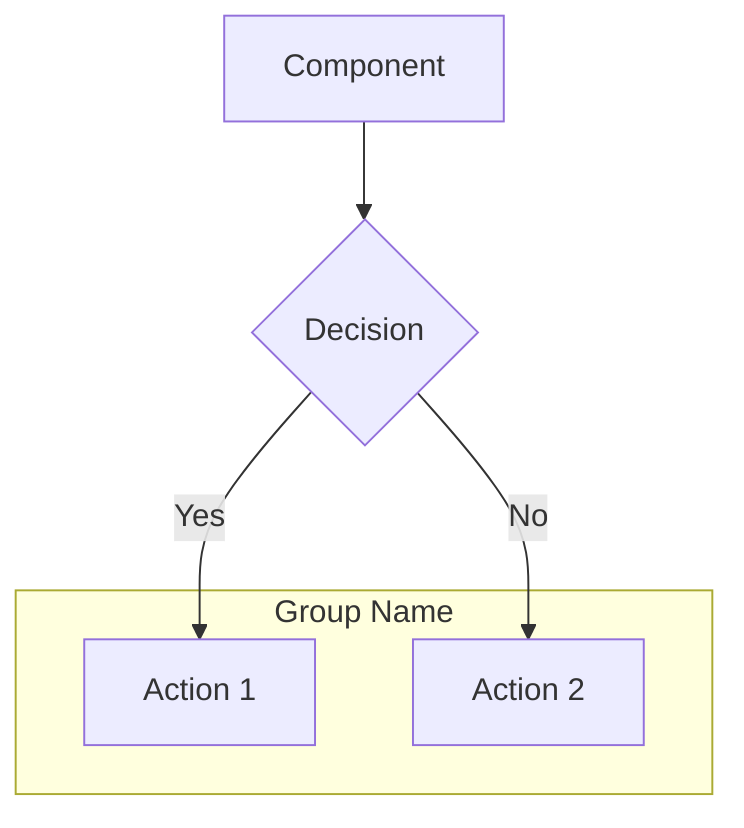

# Skill: Diagram Generation

## Overview

This skill guides creating architecture diagrams for the thesis documentation using Mermaid and PlantUML.

## Mermaid Diagrams

### Where to Use
- GitHub/GitLab README (renders natively)
- Markdown documentation
- Mermaid Live Editor: https://mermaid.live/

### Supported Types

| Type | Use Case |
|------|----------|
| `flowchart` | System flow, decision trees |
| `sequenceDiagram` | Request/response flows, API calls |
| `classDiagram` | Data models, class relationships |
| `erDiagram` | Database schema |
| `graph TD/LR` | Component architecture |
| `stateDiagram-v2` | State machines |
| `gantt` | Project timeline |

### Quick Reference



### Style Tips for Thesis
- Use `subgraph` to group related components
- Keep labels short (abbreviate in diagram, explain in caption)
- Use consistent colors: `style A fill:#f9f,stroke:#333`
- Max 15-20 nodes per diagram for readability

## PlantUML Diagrams

### Where to Use
- Export as PDF/PNG for thesis document
- VS Code with PlantUML extension (Alt+D for preview)
- Online: http://www.plantuml.com/plantuml/uml/

### Generate Commands

```bash
# All simplified diagrams (recommended for A4)
cd theory_files/plantuml_diagrams
plantuml -tpdf *-simple.puml

# Specific diagram
plantuml -tpdf sequence-diagram-simple.puml

# As PNG (for web/preview)
plantuml -tpng component-diagram.puml
```

### Available Diagrams

**Simplified (A4-optimized):**
- `class-diagram-simple.puml`
- `sequence-diagram-simple.puml`
- `deployment-diagram-simple.puml`
- `activity-diagram-simple.puml`
- `state-diagram-simple.puml`

**Full (detailed):**
- `component-diagram.puml`
- `class-diagram.puml`
- `sequence-diagram-recommend.puml`
- `sequence-diagram-feedback.puml`
- `deployment-diagram.puml`
- `activity-diagram-ingestion.puml`
- `state-diagram-query.puml`

## Diagram Checklist for Thesis

### Minimum Set (5 diagrams)
1. **Component/Architecture** — overall system structure
2. **Sequence (recommend flow)** — main use case
3. **Class diagram** — data models
4. **Deployment** — how it runs (Docker, server)
5. **ER diagram** — database schema

### Formatting for A4
- Use simplified versions (`*-simple.puml`)
- Export as PDF (vector, scales cleanly)
- Add figure captions: "Figura X.Y: Descriere"
- Reference in text: "așa cum se observă în Figura X.Y"

## Generating New Diagrams

When asking Kiro to generate a diagram:
1. Specify the type (sequence, component, class, etc.)
2. Specify the format (Mermaid for docs, PlantUML for thesis PDF)
3. Specify the scope (which components/flows to include)
4. Mention if it should be simplified for A4

Example prompt: "Generate a Mermaid sequence diagram showing the feedback flow from user rating to FeedbackStore upsert"
