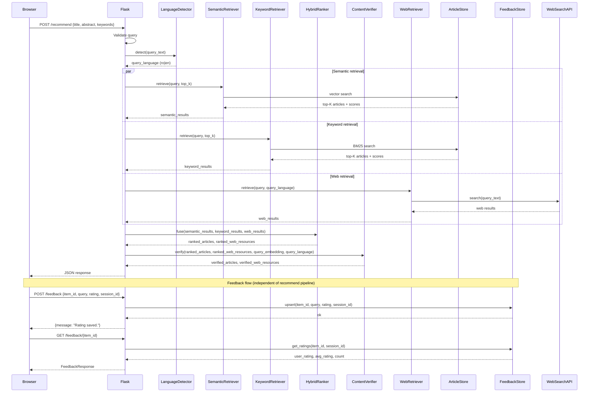
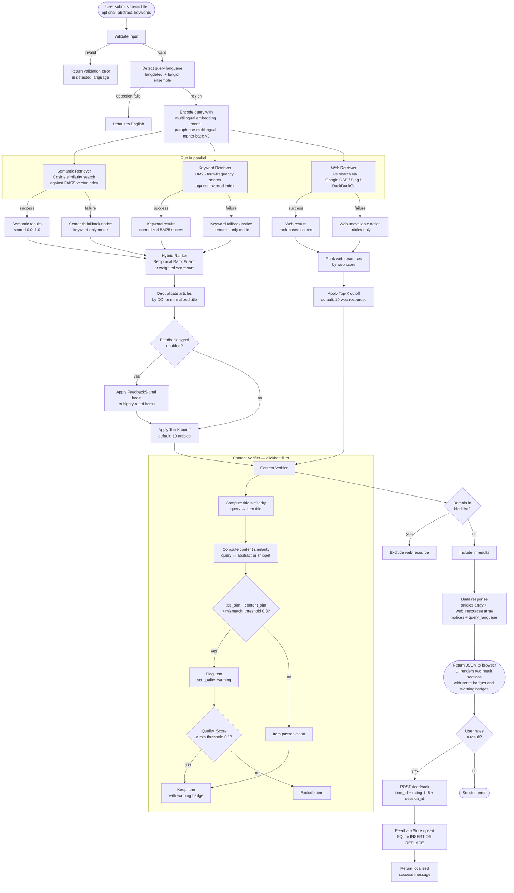
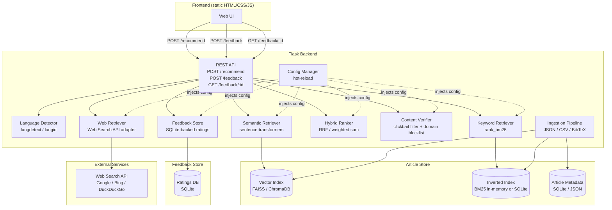

# Design Document: Hybrid Thesis Recommender

## Overview

The Hybrid Thesis Recommender is a Flask-based web application that accepts a thesis title (plus optional abstract and keywords) and returns a ranked list of academic articles and live web resources. The system combines semantic similarity search (via multilingual embeddings) with BM25 keyword retrieval into a hybrid pipeline, and augments results with live web search. It operates bilingually in Romanian and English, detecting the query language automatically and adapting all user-facing output accordingly.

### Key Design Goals

- **Hybrid retrieval quality**: Combine dense vector search and sparse BM25 to capture both conceptual and terminological relevance.
- **Bilingual transparency**: A single multilingual embedding model handles cross-lingual similarity without separate per-language indexes.
- **Resilience**: Each retrieval component (semantic, keyword, web) degrades gracefully; the system always returns whatever results are available.
- **Operator tunability**: Weights, model names, Top-K limits, and API credentials are all externalized in a hot-reloadable config file.
- **Zero-dependency frontend**: The UI is plain HTML/CSS/JS served from Flask's static directory — no build step, no framework.

### High-Level Request Flow



---

## System Flowchart

The flowchart below shows the complete end-to-end flow of a recommendation request, from the moment the user submits a thesis title to the moment results appear on screen. It covers the happy path, all fallback branches, and the independent feedback path.



---

## Algorithm Deep-Dives

This section explains the core algorithms used in the pipeline in plain terms, with the reasoning behind each choice.

---

### 1. Language Detection — Ensemble Voting

**What it does:** Identifies whether the thesis title is Romanian or English before any retrieval happens, so the system can localize messages and direct web searches to the right language.

**How it works:**
Two independent libraries — `langdetect` (based on Google's language detection library) and `langid` (a Naive Bayes classifier trained on Wikipedia) — each produce a language prediction independently. The system compares their outputs:

```
if langdetect(text) == langid(text) → use that result
if they disagree, or either throws an exception → default to "en"
```

**Why two libraries?** Short texts (a thesis title is often 5–15 words) are notoriously hard to classify reliably with a single model. Using two independent classifiers and only trusting the result when they agree significantly reduces false positives. Defaulting to English on disagreement is a safe fallback since most academic literature is in English.

---

### 2. Multilingual Sentence Embeddings — Semantic Retrieval

**What it does:** Converts the thesis title (and any abstract/keywords) into a dense vector that captures its *meaning*, not just its words. Articles with similar meanings get high similarity scores even if they use different vocabulary.

**How it works:**
The model `paraphrase-multilingual-mpnet-base-v2` (from the `sentence-transformers` library) encodes any text into a 768-dimensional vector. It was trained on parallel corpora across 50+ languages, so Romanian and English text about the same topic end up close together in vector space.

```
query_vector = model.encode("Spec-driven development using AI tools")
article_vector = model.encode("Dezvoltarea software bazată pe specificații")
similarity = cosine_similarity(query_vector, article_vector)  # → ~0.82
```

**Cosine similarity** measures the angle between two vectors (not their magnitude), which makes it robust to text length differences:

```
cosine_sim(A, B) = (A · B) / (|A| × |B|)   ∈ [-1, 1]
normalized to [0, 1] via: (cosine_sim + 1) / 2
```

**Why this model?** It natively handles cross-lingual queries — a Romanian query can retrieve English articles and vice versa — without needing separate indexes per language.

**Storage:** Article embeddings are pre-computed at ingestion time and stored in a FAISS index. At query time, only the query needs to be encoded (milliseconds), and FAISS performs an approximate nearest-neighbor search across millions of vectors in under a second.

---

### 3. BM25 — Keyword Retrieval

**What it does:** Finds articles that share exact or near-exact terminology with the thesis title. Complements semantic search by catching precise technical terms that embeddings might dilute.

**How it works:**
BM25 (Best Match 25) is a probabilistic ranking function that scores documents based on term frequency (TF) and inverse document frequency (IDF), with saturation to prevent very frequent terms from dominating:

```
BM25(d, q) = Σ_t  IDF(t) × [ TF(t,d) × (k1 + 1) ] / [ TF(t,d) + k1 × (1 - b + b × |d|/avgdl) ]
```

Where:
- `t` = each query term
- `IDF(t)` = log((N - df(t) + 0.5) / (df(t) + 0.5)) — penalizes common terms
- `TF(t,d)` = how often term `t` appears in document `d`
- `k1 = 1.5` — term frequency saturation (diminishing returns for repeated terms)
- `b = 0.75` — length normalization (longer documents are penalized slightly)
- `|d|/avgdl` — document length relative to corpus average

**Why BM25 alongside embeddings?** Embeddings are great at conceptual similarity but can miss exact technical terms. For example, a query about "FAISS vector indexing" might semantically match articles about "approximate nearest neighbor search" but miss an article that literally uses the phrase "FAISS" in its title. BM25 catches that.

Raw BM25 scores are normalized to [0.0, 1.0] by dividing by the maximum score in the result set.

---

### 4. Reciprocal Rank Fusion (RRF) — Hybrid Ranking

**What it does:** Merges the ranked lists from semantic retrieval and keyword retrieval into a single unified ranking, without needing to calibrate scores across the two systems.

**How it works:**
Instead of trying to combine raw scores (which are on different scales), RRF uses only the *rank position* of each document in each list:

```
RRF_score(d) = Σ_r  weight_r / (k + rank_r(d))
```

Where:
- `rank_r(d)` = 1-based position of document `d` in retriever `r`'s list
- `k = 60` = a constant that dampens the impact of very high ranks (standard value from the original RRF paper)
- `weight_r` = configurable weight for each retriever (default: 0.6 semantic, 0.4 keyword)

**Example:**
An article ranked #1 by semantic search and #3 by keyword search gets:
```
RRF = 0.6/(60+1) + 0.4/(60+3) = 0.00984 + 0.00635 = 0.01619
```
An article ranked #5 by semantic only (not in keyword results) gets:
```
RRF = 0.6/(60+5) = 0.00923
```
The first article wins because it appeared in both lists.

**Why RRF over weighted score averaging?** Score averaging requires both retrievers to produce comparable scales, which is hard to guarantee. RRF is scale-free — it only cares about rank order — making it more robust and easier to tune.

Documents appearing in both lists are deduplicated (by DOI, or normalized title as fallback), and their RRF scores are summed.

---

### 5. Web Score — Rank-Based Scoring

**What it does:** Converts the position returned by the web search API into a normalized relevance score.

**How it works:**
Web search APIs return results in ranked order but don't expose raw relevance scores. The system derives a score from rank position using a reciprocal function:

```
raw_score(rank) = 1.0 / (rank + 1)
```

Then normalizes across the result set:
```
web_score(d) = raw_score(d) / max(raw_score over all results)
```

This gives rank #1 a score of 1.0, rank #2 a score of 0.5, rank #3 a score of 0.33, etc. — a natural decay that reflects the well-known drop-off in click-through rates by search position.

---

### 6. Content Verifier — Clickbait Detection

**What it does:** Detects results where the title sounds relevant but the actual content (abstract or snippet) is not, and either flags or removes them.

**How it works:**
For each result, the system computes two similarity scores against the query embedding:

```
title_sim   = cosine_similarity(query_embedding, embed(item.title))
content_sim = cosine_similarity(query_embedding, embed(item.abstract_or_snippet))
```

If the gap between them exceeds the configured threshold (default 0.3):
```
if (title_sim - content_sim) > mismatch_threshold:
    Quality_Score = original_score × (1 - (title_sim - content_sim))
    flag item with quality_warning
```

Items whose `Quality_Score` drops below the minimum threshold (0.1) are excluded entirely. Items that remain above the threshold are kept but marked with a warning badge so the user can make their own judgment.

**Why not fetch the full page?** Fetching full page content for every result would add significant latency and could hit rate limits. The snippet returned by the search API is a good enough proxy — it's what the search engine itself considers the most representative excerpt.

**Domain blocklist** provides a coarser filter: known content-farm domains are excluded before the mismatch check even runs.

---

### 7. Feedback Signal Boost — Learning from User Ratings

**What it does:** Optionally gives a small ranking advantage to articles and web resources that users have consistently rated as useful for similar queries.

**How it works:**
When `feedback_signal_enabled = true`, after RRF scoring the system queries the FeedbackStore for the aggregate average rating of each result item. If the average rating meets or exceeds `feedback_signal_min_rating` (default 4.0 out of 5), a boost is added:

```
normalized_avg = (avg_rating - 1) / 4   # maps [1,5] → [0,1]
boosted_score = rrf_score + feedback_signal_boost × normalized_avg
```

The boost is additive and small (default `feedback_signal_boost = 0.1`), so it nudges highly-rated items up without overriding the core retrieval signal. Items with no ratings are unaffected.

This creates a lightweight collaborative filtering layer on top of the content-based hybrid retrieval — the more users rate items, the more the system learns what's genuinely useful for a given research area.

---

### Component Diagram



### Layered Architecture

| Layer | Responsibility |
|---|---|
| **Presentation** | Static HTML/CSS/JS; renders results, handles language toggle, shows loading state |
| **API** | Flask routes; validates input, orchestrates pipeline, serializes JSON response |
| **Retrieval** | SemanticRetriever, KeywordRetriever, WebRetriever — each independently queryable |
| **Ranking** | HybridRanker — fuses and deduplicates results from all retrievers |
| **Quality** | ContentVerifier — filters clickbait and blocklisted domains after ranking |
| **Feedback** | FeedbackStore — persists user ratings; FeedbackSignal optionally re-ranks |
| **Storage** | ArticleStore — vector index + inverted index + metadata store |
| **Ingestion** | IngestionPipeline — parses files, generates embeddings, populates ArticleStore |
| **Config** | ConfigManager — reads YAML/TOML config, watches for changes, validates values |

### Technology Choices

| Concern | Choice | Rationale |
|---|---|---|
| Web framework | Flask | Required by constraints |
| Embedding model | `sentence-transformers/paraphrase-multilingual-mpnet-base-v2` | Native RO+EN support, good cross-lingual similarity |
| Vector index | FAISS (default) or ChromaDB | FAISS is fast and dependency-light; ChromaDB adds persistence |
| BM25 | `rank_bm25` (Python) | Pure Python, no external service needed |
| Language detection | `langdetect` + `langid` (ensemble) | Robust for short texts; fallback to `en` on failure |
| Config format | YAML via `PyYAML` + `watchdog` for hot-reload | Human-readable, widely understood |
| Web search adapters | Pluggable adapter pattern | Supports Google CSE, Bing, DuckDuckGo without code changes |

---

## Components and Interfaces

### 1. REST API

#### `POST /recommend`

**Request body (JSON):**
```json
{
  "title": "string (3–500 chars, required)",
  "abstract": "string (optional)",
  "keywords": ["string", "..."] 
}
```

**Response body (JSON):**
```json
{
  "query_language": "ro|en",
  "articles": [
    {
      "resource_type": "article",
      "title": "string",
      "authors": ["string"],
      "year": 2023,
      "abstract_snippet": "string (≤300 chars)",
      "score": 0.87,
      "doi": "string|null",
      "url": "string|null",
      "quality_warning": "string|null"
    }
  ],
  "web_resources": [
    {
      "resource_type": "web",
      "title": "string",
      "url": "string",
      "snippet": "string (≤300 chars)",
      "web_score": 0.72,
      "keywords": ["string"],
      "quality_warning": "string|null"
    }
  ],
  "notices": ["string"],
  "error": null
}
```

**Validation rules:**
- `title` must be 3–500 characters after stripping whitespace
- `title` must contain at least one non-whitespace, non-punctuation character
- On validation failure: HTTP 422 with `{"error": "...", "query_language": "ro|en"}`
- On system error: HTTP 500 with `{"error": "...", "query_language": "ro|en"}`

#### `POST /feedback`

**Request body (JSON):**
```json
{
  "item_id": "string (required)",
  "query": "string (required)",
  "rating": 3,
  "session_id": "string (optional)"
}
```

**Response body (JSON):**
```json
{
  "message": "Rating saved.",
  "error": null
}
```

**Validation rules:**
- `rating` must be an integer in [1, 5]; HTTP 422 on violation
- `item_id` and `query` must be non-empty strings
- If FeedbackStore is unavailable: HTTP 503 with `{"error": "...", "message": null}`
- Upsert semantics: if a record with the same `(item_id, session_id)` already exists, it is updated rather than duplicated

#### `GET /feedback/{item_id}`

**Query parameters:** `session_id` (optional)

**Response body (JSON):**
```json
{
  "item_id": "string",
  "user_rating": 4,
  "average_rating": 3.7,
  "rating_count": 12
}
```

- `user_rating` is `null` if no rating has been submitted for this `session_id`
- `average_rating` is `null` and `rating_count` is `0` when no ratings exist for the item

### 2. Language Detector

```python
class LanguageDetector:
    def detect(self, text: str) -> Literal["ro", "en"]:
        """Returns 'ro' or 'en'. Falls back to 'en' on failure."""
```

Implementation uses an ensemble of `langdetect` and `langid`. If both agree, that result is used. If they disagree or either raises an exception, the system defaults to `"en"`.

### 3. Semantic Retriever

```python
class SemanticRetriever:
    def retrieve(self, query: Query, top_k: int) -> RetrievalResult:
        """
        Encodes query text with the multilingual embedding model,
        performs cosine similarity search against the vector index,
        returns top_k articles with scores in [0.0, 1.0].
        Raises SemanticRetrieverError on model/index failure.
        """
```

- Model is loaded once at startup and cached; model name is read from config.
- Cosine similarity scores are normalized to [0.0, 1.0] via `(score + 1) / 2` (since raw cosine is in [-1, 1]).
- On failure, raises `SemanticRetrieverError` which the orchestrator catches to trigger fallback.

### 4. Keyword Retriever

```python
class KeywordRetriever:
    def retrieve(self, query: Query, top_k: int) -> RetrievalResult:
        """
        Tokenizes query title + keywords, runs BM25 against the
        inverted index, returns top_k articles with normalized scores.
        Returns empty RetrievalResult (no error) when no terms match.
        """
```

- BM25 raw scores are normalized by dividing by the maximum score in the result set (or 1.0 if all scores are 0).
- Tokenization is language-agnostic (whitespace + punctuation split); no stemming required for MVP.
- On failure, raises `KeywordRetrieverError`.

### 5. Web Retriever

```python
class WebRetriever:
    def retrieve(self, query: Query, query_language: str) -> WebRetrievalResult:
        """
        Issues search query to the configured Web_Search_API adapter.
        If bilingual_search is enabled, issues parallel queries in ro+en
        and merges results, deduplicating by URL.
        Returns empty WebRetrievalResult (no error) when API is unavailable.
        """
```

**Adapter interface:**
```python
class WebSearchAdapter(ABC):
    @abstractmethod
    def search(self, query: str, num_results: int) -> list[RawWebResult]:
        ...

class GoogleCSEAdapter(WebSearchAdapter): ...
class BingSearchAdapter(WebSearchAdapter): ...
class DuckDuckGoAdapter(WebSearchAdapter): ...
```

Web scores are derived from rank position: `score = 1.0 / (rank + 1)`, normalized to [0.0, 1.0] over the result set.

Inaccessible URLs (HTTP 4xx/5xx on a lightweight HEAD request) are filtered out before returning results.

### 6. Hybrid Ranker

```python
class HybridRanker:
    def fuse_articles(
        self,
        semantic: RetrievalResult,
        keyword: RetrievalResult,
        top_k: int,
        semantic_weight: float,
        keyword_weight: float,
    ) -> list[ArticleRecommendation]:
        """
        Merges and deduplicates article results using Reciprocal Rank Fusion
        (default) or weighted score sum (configurable).
        Returns top_k unique articles ordered by descending combined score.
        """

    def rank_web_resources(
        self, web: WebRetrievalResult, top_k: int
    ) -> list[WebResourceRecommendation]:
        """
        Applies minimum score threshold (0.1) and returns top_k web resources
        ordered by descending web_score.
        """
```

**Reciprocal Rank Fusion formula:**
```
RRF_score(d) = Σ_r  weight_r / (k + rank_r(d))
```
where `k = 60` (standard RRF constant), `rank_r(d)` is the 1-based rank of document `d` in retriever `r`, and `weight_r` is the configured weight for that retriever.

Deduplication uses article DOI (preferred) or normalized title as the canonical key.

When `feedback_signal_enabled` is `true` in config, `fuse_articles` applies a configurable boost to items whose aggregate `FeedbackSignal` (average rating across similar queries) meets or exceeds `feedback_signal_min_rating`. The boost is additive: `boosted_score = rrf_score + feedback_signal_boost * normalized_avg_rating`. When disabled, scores are computed purely from retrieval signals.

### 7. Content Verifier

```python
class ContentVerifier:
    def verify(
        self,
        articles: list[ArticleRecommendation],
        web_resources: list[WebResourceRecommendation],
        query_embedding: np.ndarray,
        query_language: Literal["ro", "en"],
        config: AppConfig,
    ) -> tuple[list[ArticleRecommendation], list[WebResourceRecommendation]]:
        """
        For each item, computes content similarity by comparing query_embedding
        against the embedding of the item's abstract (articles) or snippet
        (web resources) using the same multilingual model as SemanticRetriever.
        Does NOT make any HTTP requests — uses only in-memory data.

        Computes Quality_Score = score * (1 - max(0, title_sim - content_sim))
        for items where (title_sim - content_sim) > config.mismatch_threshold.

        Flags items above threshold with quality_warning (localized).
        Excludes items whose Quality_Score falls below min_article_score /
        min_web_score. Excludes web resources whose domain is in domain_blocklist.

        Articles with no abstract skip the mismatch check and are retained as-is.
        """
```

**Processing rules:**
- Title similarity is the cosine similarity between `query_embedding` and the embedding of the item's title (already computed by SemanticRetriever for articles; re-computed for web resources using the same model).
- Content similarity is the cosine similarity between `query_embedding` and the embedding of the item's abstract snippet (articles) or snippet (web resources).
- `Quality_Score = score * (1 - clamp(title_sim - content_sim, 0, 1))` — the score is penalized in proportion to the mismatch magnitude.
- Domain blocklist check uses the registered domain (e.g., `example.com`) extracted from the URL; subdomains are matched against their parent domain.
- Localized `quality_warning` values: `"⚠ Verificați conținutul"` (ro) / `"⚠ Verify content"` (en).

### 8. Feedback Store

```python
class FeedbackStore:
    def upsert_rating(
        self,
        item_id: str,
        query: str,
        rating: int,
        session_id: str | None,
        timestamp: datetime,
    ) -> None:
        """
        Inserts or updates the rating for (item_id, session_id).
        Raises FeedbackStoreError if the database is unavailable.
        """

    def get_ratings(
        self, item_id: str, session_id: str | None
    ) -> FeedbackQueryResult:
        """
        Returns the user's rating for this session (or None if not submitted),
        plus aggregate average and count across all sessions for this item.
        Returns zero-count result without error when no ratings exist.
        """
```

- Backed by SQLite at the path configured in `AppConfig.feedback_store_path`.
- Schema: `ratings(item_id TEXT, session_id TEXT, query TEXT, rating INTEGER, updated_at TIMESTAMP)` with a unique constraint on `(item_id, session_id)`.
- `upsert_rating` uses `INSERT OR REPLACE` semantics.
- On database unavailability, raises `FeedbackStoreError`; the API layer returns HTTP 503.

### 9. Ingestion Pipeline

```python
class IngestionPipeline:
    def ingest_file(self, path: str, format: Literal["json", "csv", "bibtex"]) -> IngestionReport:
        """
        Parses the file, generates embeddings for each valid article,
        indexes into vector store and BM25 index.
        Skips articles missing title or abstract (logs warning).
        Supports incremental ingestion (upsert by DOI or title hash).
        """
```

Supported formats:
- **JSON**: array of objects with fields `title`, `abstract`, `authors`, `year`, `doi`, `url`, `keywords`
- **CSV**: same fields as column headers
- **BibTeX**: parsed via `bibtexparser`; maps `title`, `abstract`, `author`, `year`, `doi`, `url`, `keywords`

### 10. Config Manager

```python
class ConfigManager:
    def get(self) -> AppConfig:
        """Returns current validated config snapshot."""

    def reload(self) -> None:
        """Re-reads config file and validates; retains previous config on error."""
```

Config file is watched via `watchdog`; on file change, `reload()` is called automatically. Invalid values (negative weights, zero Top-K, unknown model names) are rejected and the previous valid config is retained with a logged warning.

---

## Data Models

### AppConfig

```python
@dataclass
class AppConfig:
    # Retrieval
    semantic_weight: float = 0.6          # must be in [0.0, 1.0]
    keyword_weight: float = 0.4           # must be in [0.0, 1.0]
    article_top_k: int = 10               # must be >= 1
    web_top_k: int = 10                   # must be >= 1
    min_article_score: float = 0.1        # must be in [0.0, 1.0]
    min_web_score: float = 0.1            # must be in [0.0, 1.0]
    fusion_strategy: str = "rrf"          # "rrf" | "weighted_sum"
    rrf_k: int = 60                       # RRF constant

    # Embedding model
    embedding_model: str = "sentence-transformers/paraphrase-multilingual-mpnet-base-v2"
    embedding_device: str = "cpu"         # "cpu" | "cuda"

    # Article store
    vector_store_backend: str = "faiss"   # "faiss" | "chromadb"
    vector_store_path: str = "./data/vector_store"
    bm25_index_path: str = "./data/bm25_index.pkl"
    metadata_db_path: str = "./data/metadata.db"

    # Web search
    web_search_provider: str = "duckduckgo"  # "google_cse" | "bing" | "duckduckgo"
    web_search_api_key: str = ""
    web_search_cx: str = ""               # Google CSE context key
    web_search_results_per_query: int = 10
    bilingual_web_search: bool = False

    # Language
    default_language: str = "en"
    language_restriction: str | None = None  # None | "ro" | "en"

    # Timeouts
    request_timeout_seconds: float = 5.0
    component_timeout_seconds: float = 8.0

    # Content quality / clickbait filtering
    mismatch_threshold: float = 0.3       # title_sim - content_sim threshold for flagging
    domain_blocklist: list[str] = field(default_factory=list)  # e.g. ["example-farm.com"]

    # Feedback / user ratings
    feedback_store_path: str = "./data/feedback.db"
    feedback_signal_enabled: bool = False
    feedback_signal_boost: float = 0.1    # additive score boost for highly-rated items
    feedback_signal_min_rating: float = 4.0  # avg rating threshold to apply boost
```

### Article (stored in ArticleStore)

```python
@dataclass
class Article:
    id: str                    # SHA-256 of DOI or normalized title
    title: str
    abstract: str
    authors: list[str]
    year: int | None
    doi: str | None
    url: str | None
    keywords: list[str]
    language: str              # "ro" | "en" | "mixed"
    embedding: np.ndarray      # stored in vector index, not in metadata DB
```

### Query

```python
@dataclass
class Query:
    title: str
    abstract: str | None
    keywords: list[str]
    query_language: str        # "ro" | "en"

    def combined_text(self) -> str:
        """Returns title + abstract + keywords joined for embedding/BM25."""
```

### RetrievalResult

```python
@dataclass
class RetrievalResult:
    items: list[ScoredArticle]
    source: Literal["semantic", "keyword"]
    error: str | None = None   # set when retriever failed

@dataclass
class ScoredArticle:
    article: Article
    score: float               # in [0.0, 1.0]
    rank: int                  # 1-based rank within this result set
```

### WebRetrievalResult

```python
@dataclass
class WebRetrievalResult:
    items: list[RawWebResult]
    error: str | None = None

@dataclass
class RawWebResult:
    title: str
    url: str
    snippet: str
    rank: int
    keywords: list[str]        # extracted from page, may be empty
```

### ArticleRecommendation / WebResourceRecommendation

```python
@dataclass
class ArticleRecommendation:
    resource_type: str = "article"
    title: str = ""
    authors: list[str] = field(default_factory=list)
    year: int | None = None
    abstract_snippet: str = ""  # ≤ 300 chars
    score: float = 0.0
    doi: str | None = None
    url: str | None = None
    quality_warning: str | None = None  # set by ContentVerifier when flagged

@dataclass
class WebResourceRecommendation:
    resource_type: str = "web"
    title: str = ""
    url: str = ""
    snippet: str = ""           # ≤ 300 chars
    web_score: float = 0.0
    keywords: list[str] = field(default_factory=list)
    quality_warning: str | None = None  # set by ContentVerifier when flagged
```

### RecommendResponse

```python
@dataclass
class RecommendResponse:
    query_language: str
    articles: list[ArticleRecommendation]
    web_resources: list[WebResourceRecommendation]
    notices: list[str]          # fallback notices, empty-result messages
    error: str | None = None
```

### FeedbackEntry

```python
@dataclass
class FeedbackEntry:
    item_id: str
    session_id: str | None
    query: str
    rating: int                 # integer in [1, 5]
    updated_at: datetime
```

### FeedbackRequest / FeedbackResponse

```python
@dataclass
class FeedbackRequest:
    item_id: str
    query: str
    rating: int                 # integer in [1, 5]; validated before persistence
    session_id: str | None = None

@dataclass
class FeedbackResponse:
    message: str | None = None  # localized success message
    error: str | None = None
```

### FeedbackQueryResult

```python
@dataclass
class FeedbackQueryResult:
    item_id: str
    user_rating: int | None     # rating submitted by this session, or None
    average_rating: float | None  # None when rating_count == 0
    rating_count: int           # 0 when no ratings exist
```

---

## Correctness Properties

*A property is a characteristic or behavior that should hold true across all valid executions of a system — essentially, a formal statement about what the system should do. Properties serve as the bridge between human-readable specifications and machine-verifiable correctness guarantees.*

### Property 1: ContentVerifier flagging correctness

*For any* item (article or web resource) and any configured mismatch threshold, the ContentVerifier SHALL set `quality_warning` on that item if and only if `(title_similarity - content_similarity) > mismatch_threshold`.

**Validates: Requirements 5b.3**

### Property 2: ContentVerifier filter completeness

*For any* result set produced by ContentVerifier, no item in the output SHALL have a `Quality_Score` below the applicable minimum threshold (`min_article_score` for articles, `min_web_score` for web resources). Items above the threshold that were flagged SHALL carry a `quality_warning`; items below the threshold SHALL be absent from the output entirely.

**Validates: Requirements 5b.5, 5b.6**

### Property 3: Articles without abstracts pass through unflagged

*For any* article whose `abstract` field is `None` or empty, the ContentVerifier SHALL retain that article in the output without setting `quality_warning`, regardless of the mismatch threshold.

**Validates: Requirements 5b.8**

### Property 4: Domain blocklist exclusion

*For any* web resource whose URL's registered domain appears in `AppConfig.domain_blocklist`, the ContentVerifier SHALL exclude that web resource from the output without performing the mismatch check.

**Validates: Requirements 5b.9**

### Property 5: Rating persistence round-trip

*For any* valid `(item_id, query, rating, session_id)` tuple submitted to `POST /feedback`, a subsequent call to `GET /feedback/{item_id}` with the same `session_id` SHALL return a `user_rating` equal to the submitted rating, and `rating_count` SHALL be at least 1.

**Validates: Requirements 12.2, 12.7**

### Property 6: Rating validation rejects out-of-range values

*For any* rating value that is not an integer in [1, 5], `POST /feedback` SHALL return a validation error (HTTP 422) and SHALL NOT persist any record to the FeedbackStore.

**Validates: Requirements 12.3**

### Property 7: Rating upsert idempotence

*For any* `(item_id, session_id)` pair, submitting N ratings in sequence SHALL result in exactly one record in the FeedbackStore for that pair, containing the most recently submitted rating value.

**Validates: Requirements 12.4**

### Property 8: Feedback signal boost monotonicity

*For any* result set where `feedback_signal_enabled = True`, an item's boosted score SHALL be greater than or equal to its unboosted score. When `feedback_signal_enabled = False`, every item's score SHALL equal its unboosted score (no boost applied).

**Validates: Requirements 12.8, 12.9**

---

## Error Handling

### Component Failure Modes

| Component | Failure | System Response |
|---|---|---|
| SemanticRetriever | Model unavailable / index corrupt | Fall back to keyword-only; add notice to response |
| KeywordRetriever | Index unavailable | Fall back to semantic-only; add notice to response |
| Both retrievers | Both fail | Return HTTP 500 with structured error |
| WebRetriever | API unavailable / timeout | Return article results only; add notice |
| ContentVerifier | Embedding model error | Log warning; return items without quality filtering (fail open) |
| FeedbackStore | DB unavailable on write | Return HTTP 503; do not silently discard rating |
| FeedbackStore | DB unavailable on read | Return HTTP 503 |
| ConfigManager | Invalid config on reload | Retain previous valid config; log warning |

### Timeout Strategy

- Each component is wrapped in a timeout guard using `concurrent.futures` with `component_timeout_seconds` (default 8 s).
- The overall request must complete within `request_timeout_seconds` (default 5 s); if not, a partial response is returned with a timeout notice.
- Feedback endpoints (`POST /feedback`, `GET /feedback/{item_id}`) share the same `component_timeout_seconds` limit for FeedbackStore operations.

### Localized Error Messages

All user-facing error and notice strings are keyed by `query_language`:

| Key | Romanian | English |
|---|---|---|
| no_articles | "Nu au fost găsite articole suficient de relevante." | "No sufficiently relevant articles were found." |
| no_web_resources | "Nu au fost găsite resurse web suficient de relevante." | "No sufficiently relevant web resources were found." |
| semantic_unavailable | "Recuperarea semantică nu a fost disponibilă." | "Semantic retrieval was unavailable." |
| keyword_unavailable | "Recuperarea prin cuvinte cheie nu a fost disponibilă." | "Keyword retrieval was unavailable." |
| web_unavailable | "Recuperarea resurselor web nu a fost disponibilă." | "Web resource retrieval was unavailable." |
| quality_warning | "⚠ Verificați conținutul" | "⚠ Verify content" |
| rating_saved | "Evaluarea a fost salvată." | "Rating saved." |
| rating_invalid | "Evaluarea trebuie să fie un număr întreg între 1 și 5." | "Rating must be an integer between 1 and 5." |

---

## Testing Strategy

### Dual Testing Approach

Both unit tests and property-based tests are used. Unit tests cover specific examples, integration points, and error conditions. Property-based tests verify universal invariants across a wide input space.

**Property-based testing library:** `hypothesis` (Python)

Each property test runs a minimum of 100 iterations. Tests are tagged with a comment referencing the design property:
```python
# Feature: hybrid-thesis-recommender, Property 1: ContentVerifier flagging correctness
```

### Unit Tests

- `LanguageDetector`: correct detection for RO/EN samples; fallback to `en` on ambiguous input.
- `SemanticRetriever`: score normalization to [0.0, 1.0]; error propagation on model failure.
- `KeywordRetriever`: BM25 score normalization; empty result on no-match; error propagation.
- `WebRetriever`: URL deduplication in bilingual mode; inaccessible URL filtering; adapter selection.
- `HybridRanker`: RRF formula correctness; deduplication by DOI; single-retriever fallback; feedback boost applied/not applied based on config.
- `ContentVerifier`: localized warning strings (RO/EN); no-abstract pass-through; domain blocklist exclusion; no HTTP calls made during evaluation.
- `FeedbackStore`: upsert semantics; zero-count response for unknown item; error on DB unavailability.
- `ConfigManager`: invalid value rejection; hot-reload retains previous config on error; new fields (`mismatch_threshold`, `domain_blocklist`, `feedback_*`) validated correctly.
- API layer: HTTP 422 on invalid query; HTTP 422 on invalid rating; HTTP 503 on FeedbackStore unavailability; correct JSON serialization of `quality_warning` (omitted when `None`).

### Property-Based Tests

| Property | Hypothesis Strategy |
|---|---|
| P1: ContentVerifier flagging | Generate random `(title_sim, content_sim, threshold)` floats in [0,1]; verify flagging iff difference > threshold |
| P2: Filter completeness | Generate random item lists with random Quality_Scores; verify no output item is below min threshold |
| P3: No-abstract pass-through | Generate articles with `abstract=None`; verify all retained without `quality_warning` |
| P4: Domain blocklist exclusion | Generate random URLs and blocklists; verify all blocklisted domains absent from output |
| P5: Rating round-trip | Generate valid `(item_id, query, rating, session_id)` tuples; verify GET returns submitted rating |
| P6: Rating validation | Generate out-of-range rating values; verify all rejected with HTTP 422 |
| P7: Upsert idempotence | Generate sequences of N ratings for same `(item_id, session_id)`; verify exactly 1 record with latest value |
| P8: Feedback boost monotonicity | Generate result sets with random avg ratings; verify boosted scores >= unboosted when enabled, equal when disabled |

### Integration Tests

- End-to-end `POST /recommend` with a real (small) article corpus: verify response structure, score ranges, and `quality_warning` presence/absence.
- `POST /feedback` → `GET /feedback/{item_id}` round-trip against a real SQLite FeedbackStore.
- ContentVerifier with real embedding model: verify blocklisted domain is excluded; verify flagged item carries correct localized warning.
