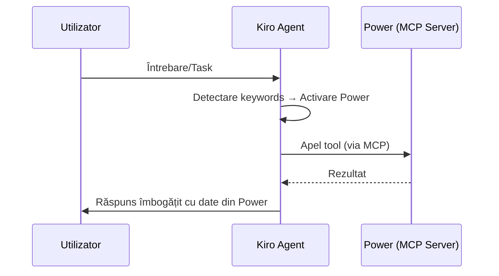

# Kiro Powers — Extensii Modulare pentru Dezvoltare

## 1. Introducere

Kiro Powers sunt pachete extensibile care adaugă capabilități suplimentare agentului AI din Kiro. Ele funcționează ca un sistem de plugin-uri care combină documentație, tool-uri externe (via MCP), și ghiduri de workflow într-un singur pachet instalabil.

## 2. Arhitectura unui Power

### 2.1 Componente

```
my-power/
├── POWER.md              # Documentație principală (obligatoriu)
├── mcp-servers/          # Servere MCP incluse (opțional)
│   └── server-config.json
└── steering/             # Steering files specifice (opțional)
    └── workflow-guide.md
```

| Componentă | Rol | Obligatoriu |
|------------|-----|:-----------:|
| **POWER.md** | Documentație, instrucțiuni de utilizare, exemple | ✅ |
| **MCP Servers** | Tool-uri externe accesibile agentului | ❌ |
| **Steering Files** | Ghiduri de workflow pentru taskuri specifice | ❌ |

### 2.2 Ciclul de Viață

```
Instalare → Activare → Utilizare → Dezactivare/Dezinstalare
```

1. **Instalare**: Din panoul Powers din Kiro
2. **Activare**: Automată (pe baza keyword-urilor) sau manuală
3. **Utilizare**: Agentul accesează tool-urile și documentația
4. **Dezactivare**: Power-ul rămâne instalat dar inactiv

## 3. Cum Funcționează Powers

### 3.1 Activare pe Bază de Keywords

Fiecare Power are keywords asociate. Când utilizatorul menționează un termen relevant, Kiro activează automat Power-ul corespunzător:

```
Utilizator: "Vreau să fac deploy pe AWS"
                    ↓
Kiro detectează keyword "AWS" → Activează AWS Documentation Power
                    ↓
Kiro are acces la tool-uri AWS + documentație actualizată
```

### 3.2 Fluxul de Utilizare



### 3.3 Acțiuni Disponibile

| Acțiune | Descriere |
|---------|-----------|
| **list** | Listează toate Powers instalate |
| **activate** | Încarcă documentația și tool-urile unui Power |
| **use** | Execută un tool specific dintr-un Power |
| **readSteering** | Citește un ghid de workflow |
| **configure** | Deschide panoul de management |

## 4. Tipuri de Powers

### 4.1 Powers de Documentație

Oferă acces la documentație actualizată fără a polua contextul:

- **AWS Documentation** — documentație servicii AWS
- **Framework Docs** — documentație React, Vue, Angular, etc.
- **Language References** — referințe Python, TypeScript, Rust

**Avantaj**: Documentația este încărcată on-demand, nu permanent în context.

### 4.2 Powers cu Tool-uri (MCP)

Adaugă capabilități concrete prin servere MCP:

- **Database Powers** — interogare baze de date (SQLite, PostgreSQL, MongoDB)
- **API Powers** — acces la API-uri externe (GitHub, Jira, Slack)
- **Cloud Powers** — management resurse cloud (AWS, GCP, Azure)
- **Search Powers** — căutare în surse specializate

**Avantaj**: Agentul poate executa acțiuni reale, nu doar genera cod.

### 4.3 Powers de Workflow

Ghidează agentul prin procese complexe:

- **Code Review Power** — workflow structurat de review
- **Migration Power** — ghid pas-cu-pas pentru migrări
- **Testing Power** — strategii de testare adaptate proiectului

**Avantaj**: Consistență în procese repetitive.

## 5. Relevanță pentru Proiectul Hybrid Thesis Recommender

### 5.1 Powers Potențial Utile

| Power | Utilizare în Proiect |
|-------|---------------------|
| **SQLite Power** | Interogare directă `articles.db`, `feedback.db`, `users.db` |
| **Fetch/Web Power** | Acces la documentație online, API-uri academice |
| **Diagram Power** | Generare diagrame PlantUML/Mermaid din cod |
| **Academic Search** | Căutare articole pe Semantic Scholar, arXiv |
| **Docker Power** | Asistență deployment și containerizare |

### 5.2 Power Custom: Academic Article Fetcher

Un Power custom ar putea fi construit pentru acest proiect:

```
academic-fetcher-power/
├── POWER.md
│   └── Instrucțiuni: cum să cauți articole, formate acceptate,
│       cum să ingestezi rezultatele în article_store
├── mcp-servers/
│   └── academic-api-server/
│       ├── semantic_scholar.py   # Tool: search_papers(query)
│       ├── arxiv.py              # Tool: search_arxiv(query, category)
│       └── crossref.py           # Tool: lookup_doi(doi)
└── steering/
    └── ingestion-workflow.md     # Ghid: căutare → validare → ingestie
```

**Tool-uri expuse**:
- `search_papers(query, limit)` — căutare pe Semantic Scholar
- `search_arxiv(query, category)` — căutare pe arXiv
- `lookup_doi(doi)` — metadata articol după DOI
- `ingest_results(articles, format)` — ingestie directă în pipeline

### 5.3 MCP Servers Deja Configurate (echivalent Powers)

Proiectul folosește deja servere MCP care oferă funcționalitate similară Powers:

```json
{
  "mcpServers": {
    "sqlite": {
      "command": "uvx",
      "args": ["mcp-server-sqlite", "--db-path", "data/articles.db"]
    },
    "fetch": {
      "command": "uvx",
      "args": ["mcp-server-fetch"]
    }
  }
}
```

Diferența: MCP servers sunt configurate manual, Powers sunt pachete pre-configurate cu documentație inclusă.

## 6. Crearea unui Power Custom

### 6.1 Prerequisite

- Instalarea Power-ului "Build a Power" din panoul Kiro
- Definirea scopului și tool-urilor necesare

### 6.2 Structura POWER.md

```markdown
# My Custom Power

## Overview
Descriere scurtă a ce face power-ul.

## Keywords
database, sqlite, articles, academic

## Tools
### search_articles
Caută articole în baza de date locală.
- **Input**: query (string), limit (int)
- **Output**: lista de articole cu metadata

### get_statistics
Returnează statistici despre corpus.
- **Input**: none
- **Output**: total articles, by language, by year

## Workflows
### Ingestion Workflow
1. Caută articole noi pe Semantic Scholar
2. Validează metadata (titlu, abstract prezente)
3. Ingestează în pipeline
4. Verifică indexarea în FAISS
```

### 6.3 Definirea MCP Server

```python
# server.py — MCP server pentru power custom
from mcp.server import Server
from mcp.types import Tool, TextContent

server = Server("academic-tools")

@server.tool()
async def search_papers(query: str, limit: int = 10) -> list[dict]:
    """Caută articole academice pe Semantic Scholar."""
    # Implementare...
    pass

@server.tool()
async def get_corpus_stats() -> dict:
    """Returnează statistici despre corpusul local."""
    # Implementare...
    pass
```

## 7. Comparație: MCP Servers vs Powers

| Aspect | MCP Server (raw) | Power |
|--------|-------------------|-------|
| Configurare | Manuală în `mcp.json` | Automată la instalare |
| Documentație | Externă / inexistentă | Inclusă (POWER.md) |
| Activare | Permanentă | On-demand (keywords) |
| Workflow guides | Nu | Da (steering files) |
| Sharing | Copy-paste config | Instalare din catalog |
| Context overhead | Permanent în memorie | Încărcat doar la nevoie |
| Compunere | Servere individuale | Pachet unitar (docs + tools + guides) |

## 8. Avantaje ale Sistemului de Powers

### 8.1 Minimal Context Loading

Powers nu încarcă toate tool-urile simultan. Agentul vede doar o listă de Powers disponibile și le activează on-demand:

```
Fără Powers: 50+ tool-uri încărcate permanent → context poluat
Cu Powers: 5 acțiuni de management + tool-uri încărcate la cerere → context curat
```

### 8.2 Structured Discovery

Activarea unui Power returnează:
- Documentație completă (POWER.md)
- Tool-uri grupate pe server cu schema de input
- Steering files disponibile

### 8.3 Guided Workflows

Steering files din Powers oferă instrucțiuni pas-cu-pas pentru taskuri complexe, asigurând consistență și calitate.

### 8.4 Reusability

Powers pot fi:
- Partajate între proiecte
- Versionate independent
- Compuse (un Power poate depinde de altul)

## 9. Integrare în Fluxul de Dezvoltare

```
┌─────────────────────────────────────────────────────┐
│                    Kiro IDE                          │
├─────────────────────────────────────────────────────┤
│                                                     │
│  Steering Files ──→ Context persistent              │
│       ↓                                             │
│  Specs ──→ Cerințe + Design + Tasks                 │
│       ↓                                             │
│  Powers ──→ Tool-uri + Docs on-demand               │
│       ↓                                             │
│  MCP Servers ──→ Acces date + API-uri               │
│       ↓                                             │
│  Hooks ──→ Automatizări (lint, test, deploy)        │
│       ↓                                             │
│  Agent AI ──→ Implementare + Validare               │
│                                                     │
└─────────────────────────────────────────────────────┘
```

## 10. Concluzii

Kiro Powers reprezintă un nivel de abstractizare peste MCP servers care adaugă:
- **Documentație integrată** — agentul știe cum să folosească tool-urile
- **Activare inteligentă** — tool-urile sunt disponibile doar când sunt relevante
- **Workflow-uri ghidate** — procese complexe devin reproductibile
- **Modularitate** — capabilități adăugate/eliminate fără a afecta restul sistemului

Pentru proiectul Hybrid Thesis Recommender, Powers completează ecosistemul de dezvoltare oferind acces structurat la resurse academice, baze de date, și instrumente de documentare — toate integrate nativ în fluxul de lucru al agentului AI.
