# Arhitectura Sistemului - Hybrid Thesis Recommender

## 1. Prezentare Generală

Hybrid Thesis Recommender este un sistem de recomandare academic care combină căutarea semantică (FAISS), potrivirea cuvintelor cheie (BM25) și căutarea web live pentru a oferi resurse relevante pentru cercetare. Sistemul este construit pe o arhitectură modulară, scalabilă și bilingvă (română/engleză).

---

## 2. Arhitectura de Nivel Înalt

### 2.1 Diagrama Arhitecturală Generală

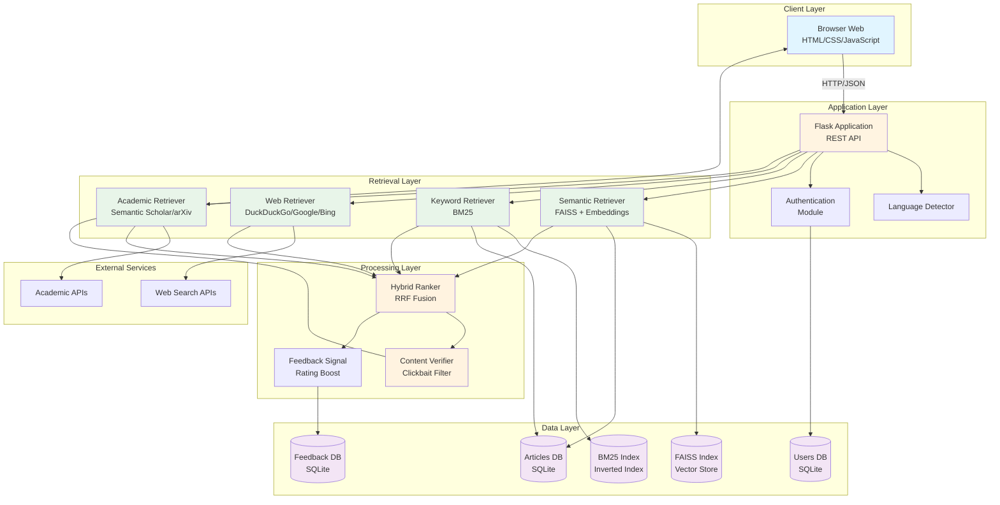

---

## 3. Arhitectura pe Straturi (Layered Architecture)

### 3.1 Diagrama Straturilor

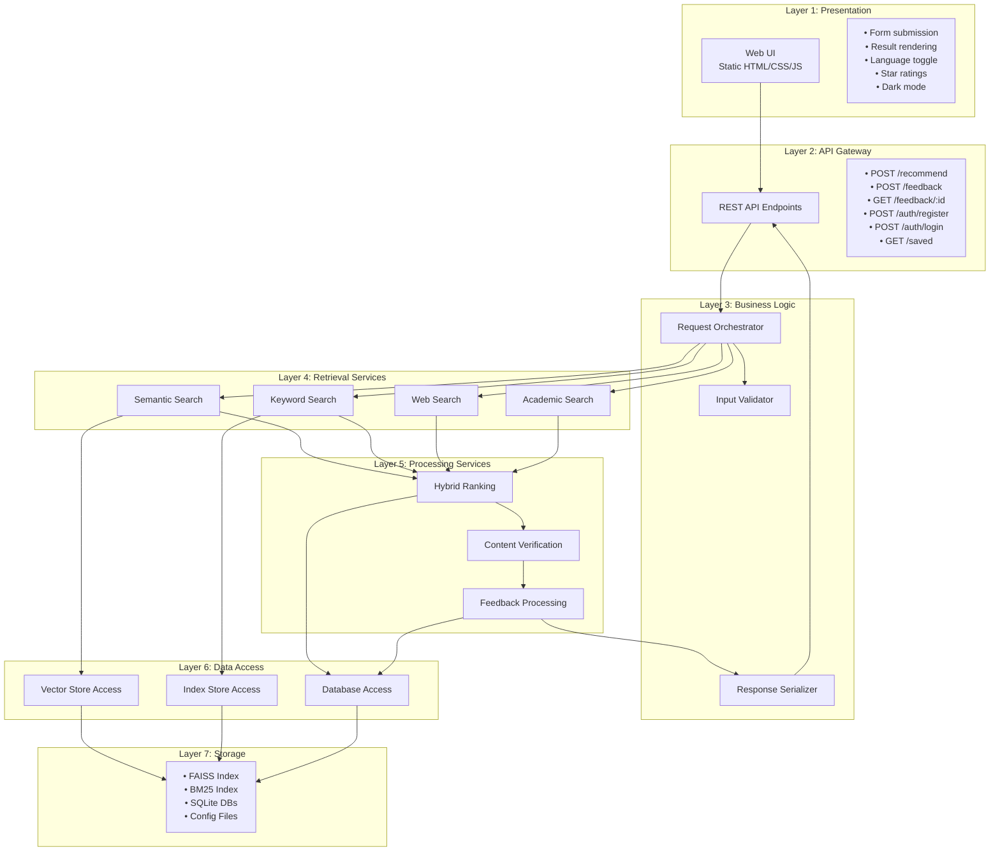

---

## 4. Arhitectura Componentelor

### 4.1 Diagrama Componentelor Detaliate

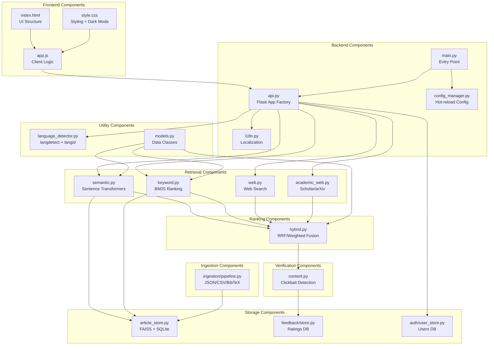

---

## 5. Fluxul de Date (Data Flow)

### 5.1 Fluxul unei Cereri de Recomandare

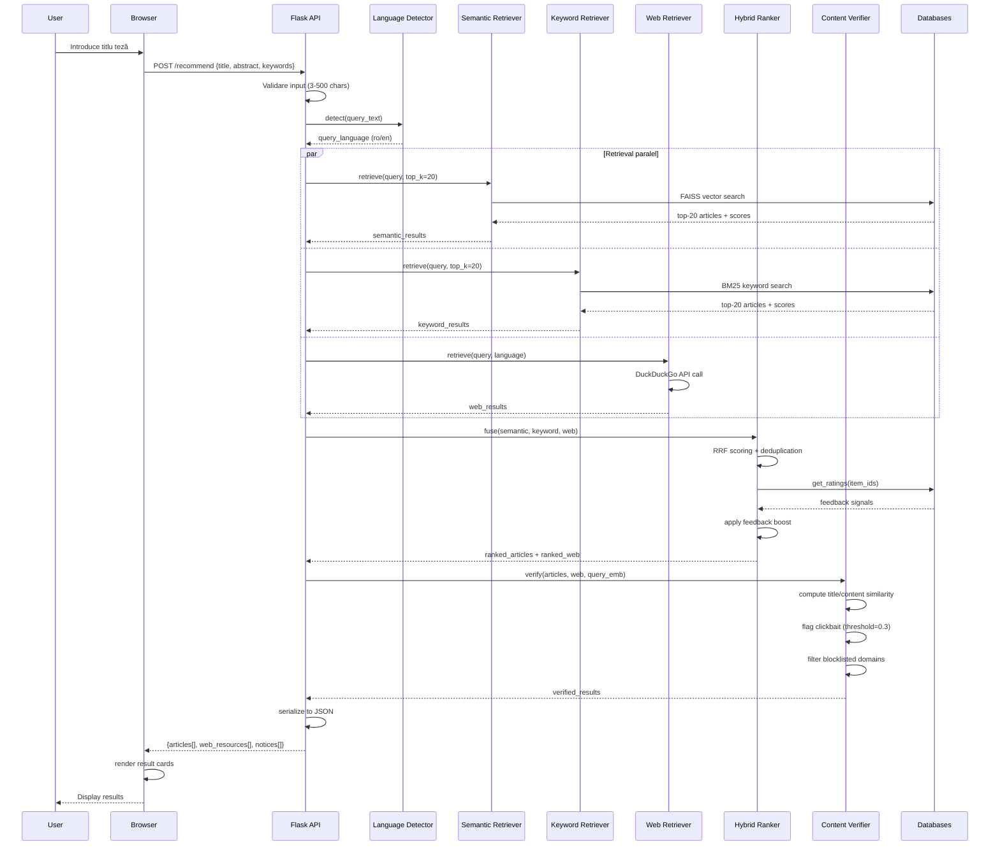

### 5.2 Fluxul Feedback-ului

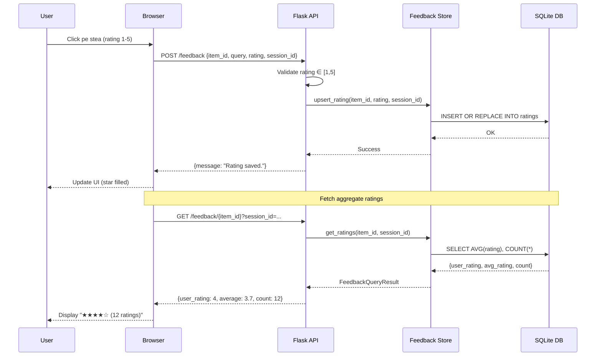

---

## 6. Arhitectura Bazei de Date

### 6.1 Schema Bazei de Date

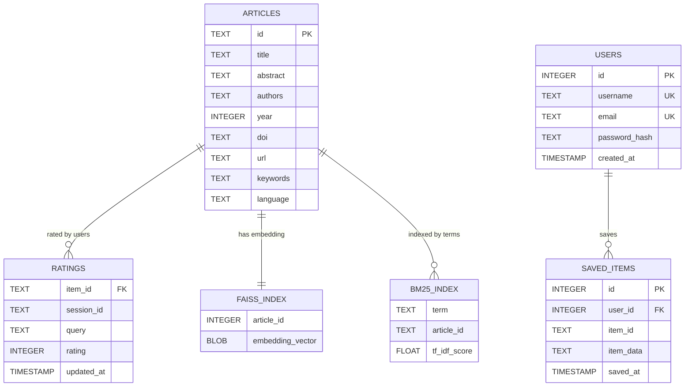

### 6.2 Structura Fișierelor de Date

```
data/
├── articles.db          # SQLite: metadata articole
├── faiss.index          # FAISS: vector embeddings (768-dim)
├── bm25.pkl            # Pickle: BM25 inverted index
├── feedback.db         # SQLite: user ratings
└── users.db            # SQLite: user accounts + saved items
```

---

## 7. Arhitectura de Deployment

### 7.1 Diagrama de Deployment

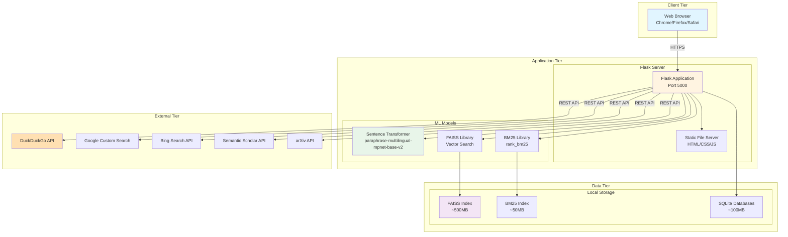

### 7.2 Deployment cu Docker (Opțional)

```mermaid
graph TB
    subgraph "Docker Container"
        subgraph "Application"
            Flask[Flask App<br/>Python 3.10]
            Gunicorn[Gunicorn WSGI<br/>4 workers]
        end
        
        subgraph "Dependencies"
            PyTorch[PyTorch<br/>sentence-transformers]
            FAISS_Docker[FAISS-CPU]
            SQLite_Docker[SQLite3]
        end
        
        subgraph "Volumes"
            DataVol[/data<br/>Persistent Volume]
            ConfigVol[/config<br/>Config Files]
        end
    end

    subgraph "Host Machine"
        Port[Port 5000:5000]
        HostData[./data/]
        HostConfig[./config.yaml]
    end

    Gunicorn --> Flask
    Flask --> PyTorch
    Flask --> FAISS_Docker
    Flask --> SQLite_Docker
    
    Flask --> DataVol
    Flask --> ConfigVol
    
    Port --> Gunicorn
    HostData -.->|mount| DataVol
    HostConfig -.->|mount| ConfigVol
```

---

## 8. Arhitectura de Securitate

### 8.1 Diagrama Securității

```mermaid
graph TB
    subgraph "Security Layers"
        subgraph "Layer 1: Input Validation"
            InputVal[• Query length: 3-500 chars<br/>• Rating range: 1-5<br/>• SQL injection prevention<br/>• XSS sanitization]
        end
        
        subgraph "Layer 2: Authentication"
            Auth[• Session-based auth<br/>• Password hashing (bcrypt)<br/>• CSRF protection<br/>• Secure cookies]
        end
        
        subgraph "Layer 3: Authorization"
            Authz[• User-specific saved items<br/>• Session validation<br/>• Rate limiting<br/>• API key management]
        end
        
        subgraph "Layer 4: Data Protection"
            DataProt[• SQLite file permissions<br/>• Config file encryption<br/>• API key storage<br/>• No sensitive data in logs]
        end
        
        subgraph "Layer 5: External API Security"
            ExtSec[• HTTPS only<br/>• API key rotation<br/>• Request timeouts<br/>• Error handling]
        end
    end

    InputVal --> Auth
    Auth --> Authz
    Authz --> DataProt
    DataProt --> ExtSec
```

---

## 9. Arhitectura de Scalabilitate

### 9.1 Puncte de Scalare

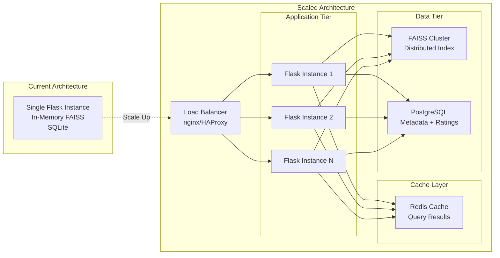

---

## 10. Arhitectura de Configurare

### 10.1 Managementul Configurației

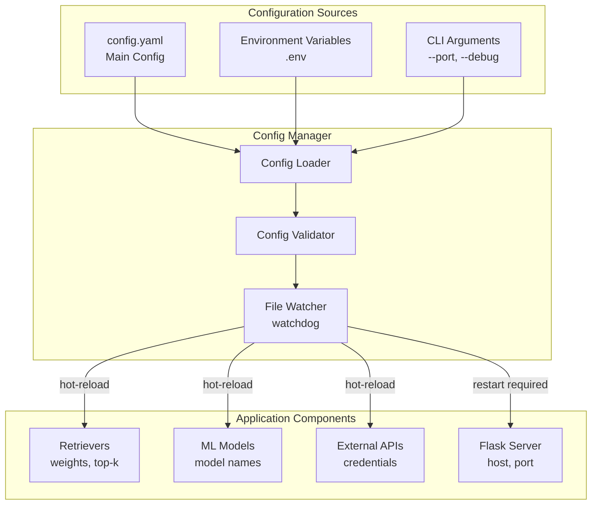

### 10.2 Parametri de Configurare

```yaml
# Retrieval Configuration
semantic_weight: 0.6          # Semantic vs keyword balance
keyword_weight: 0.4
article_top_k: 10             # Max articles returned
web_top_k: 10                 # Max web resources returned
min_article_score: 0.1        # Minimum relevance threshold
min_web_score: 0.05

# Model Configuration
embedding_model: "paraphrase-multilingual-mpnet-base-v2"
vector_store_path: "data/faiss.index"
bm25_index_path: "data/bm25.pkl"

# Web Search Configuration
web_search_provider: "duckduckgo"  # duckduckgo | google_cse | bing
web_search_num_results: 50
bilingual_web_search: false

# Content Verification
mismatch_threshold: 0.3       # Clickbait detection threshold
domain_blocklist: []          # Blocked domains

# Feedback Configuration
feedback_signal_enabled: false
feedback_signal_boost: 0.1
feedback_signal_min_rating: 4.0

# Performance
request_timeout_seconds: 20.0
component_timeout_seconds: 18.0
fusion_strategy: "rrf"        # rrf | weighted_sum
```

---

## 11. Metrici și Monitorizare

### 11.1 Arhitectura de Monitorizare

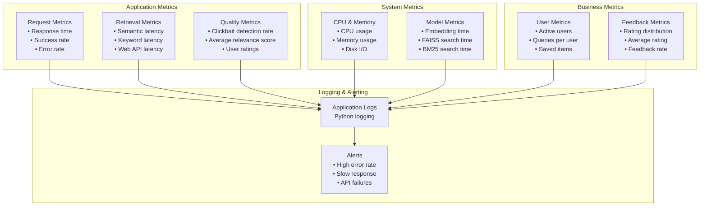

---

## 12. Rezumat Arhitectural

### 12.1 Caracteristici Cheie

| Aspect | Detalii |
|--------|---------|
| **Stil Arhitectural** | Layered Architecture + Microservices-ready |
| **Pattern-uri** | Repository, Factory, Strategy, Observer |
| **Scalabilitate** | Vertical (current), Horizontal (planned) |
| **Disponibilitate** | Single instance (current), HA (planned) |
| **Performanță** | <5s response time, parallel retrieval |
| **Securitate** | Input validation, session auth, HTTPS |
| **Mentenabilitate** | Modular, hot-reload config, comprehensive logging |

### 12.2 Tehnologii Utilizate

| Layer | Tehnologii |
|-------|------------|
| **Frontend** | HTML5, CSS3, Vanilla JavaScript |
| **Backend** | Flask 3.1.1, Python 3.10+ |
| **ML/AI** | sentence-transformers, FAISS, BM25 |
| **Storage** | SQLite, FAISS index, Pickle |
| **External APIs** | DuckDuckGo, Google CSE, Bing, Semantic Scholar, arXiv |
| **Testing** | pytest, hypothesis (property-based testing) |
| **Config** | PyYAML, watchdog (hot-reload) |

---

## 13. Evoluție Viitoare

### 13.1 Roadmap Arhitectural

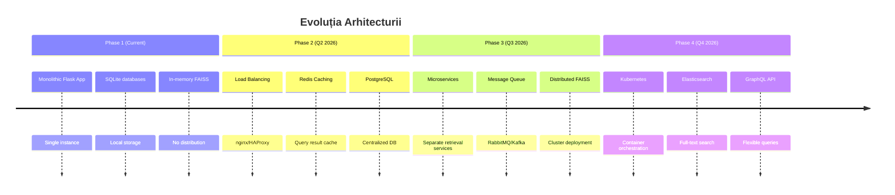

---

## Concluzie

Arhitectura Hybrid Thesis Recommender este proiectată pentru:
- ✅ **Modularitate**: Componente independente, ușor de testat și înlocuit
- ✅ **Scalabilitate**: Pregătită pentru creștere orizontală
- ✅ **Performanță**: Retrieval paralel, caching, optimizări
- ✅ **Mentenabilitate**: Cod curat, documentație, logging
- ✅ **Extensibilitate**: Ușor de adăugat noi retrievers, rankers, verificatori

Sistemul este construit pe principii solide de inginerie software și este pregătit pentru evoluție continuă.
